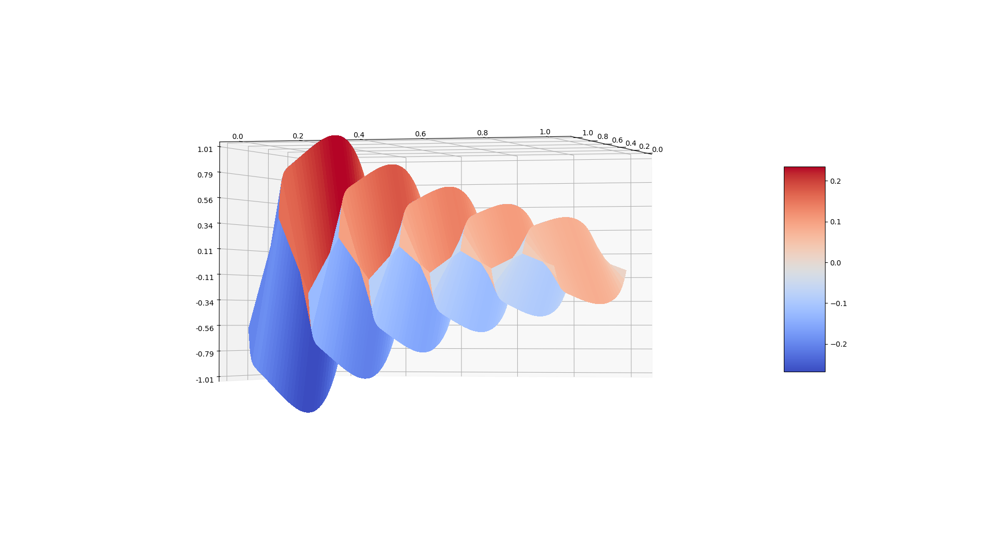
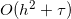

# Heat equation. C++ implementation.

## Table of content

- [Heat equation. C++ implementation.](#heat-equation-c---implementation)
  * [Problem](#problem)
  * [Requirements](#requirements)
  * [How to start](#how-to-start)
  * [Visualization](#visualization)
  * [Solution and hacks](#solution-and-hacks)
    + [Thomas Algorithm](#thomas-algorithm)
    + [Finding solution](#finding-solution)
  * [Benchmarks](#benchmarks)
  * [Calculation error](#calculation-error)

## Problem

We need to solve a [partial differential equation](https://en.wikipedia.org/wiki/Partial_differential_equation) of [heat equation](https://en.wikipedia.org/wiki/Heat_equation) using [implicit Euler method](https://en.wikipedia.org/wiki/Backward_Euler_method).  

## Requirements

* [CMake](https://cmake.org/) v3.10 performance guaranteed.
* [G++ compiler](https://gcc.gnu.org/) v7.3 performance guaranteed.
* [Python](https://www.python.org/) 3* with installed [matplotlib](https://matplotlib.org/) for visualization.

## How to start

1. Clone repo: `git clone https://github.com/Atlant154/cm_heat_equation_cpp.git`
2. Move to directory: `cd cm_heat_equation_cpp`
3. Build the project: `cmake -DCMAKE_BUILD_TYPE=Release .. && make`
4. Run the program: `./cm_heat_equation_cpp`

## Visualization

After running the program in the `./result` directory, the `result.txt` file is generated.  
To visualize the data obtained during the execution of the program, do the following command: `cd results && python3 vizualization.py`

Also in the `./result` directory there is a `check.py` script, which is easily configured to get an image of the exact solution,
if there is one.

## Solution and hacks

### Thomas Algorithm

To solve three-diagonal matrix that appears during the solution, the
[Thomas Algorithm](https://en.wikipedia.org/wiki/Tridiagonal_matrix_algorithm) is traditionally used.
At my decision applies a modified version of the algorithm, as the diagonal of the matrix composed of
the same elements, as well upper and lower diagonal coincide.  
This change gives a significant performance boost, but you will not able to use this implementation
in other projects.

### Finding solution

To store the solution before writing to the file, cpp vectors are used. This approach is slower than
raw arrays, but not much(less than 10%).

## Benchmarks

All results were obtained by running benchmark of 10'000 times. The benchmark consisted of created object + and calculating an approximate solution. The problem was considered with hundred of time layers.

|        Splits:       |     128    |     512    | 1'024      | 8'192      | 32'768    | 131'072 |
|:--------------------:|:----------:|:----------:|------------|------------|-----------|---------|
|   Cpp(unoptimized):  | 604.942 μs | 2307.75 μs | 4226.58 μs | 34498.1 μs | 143869 μs |         |

Configuration of the system on which the testing was conducted: Intel I7-6700 + 16GB RAM.

## Calculation error

Calculation error is calculated as: . You can verify this using `get_error()` and `get_max_error()` methods.
